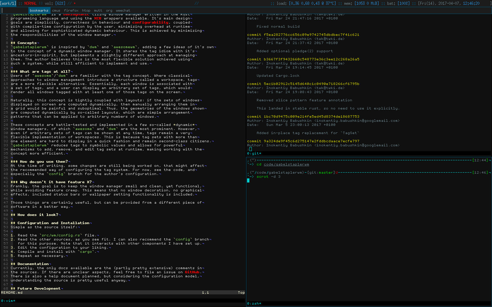

# gabelstaplerwm
**NOTE**: gabelstaplerwm is currently being rewritten (because I can't get my
priorities straight and do such things). During that time, the `master` branch will hold
the rewrite (for various reasons), the stable and working codebase will still receive
bugfixes in case something catastrophic happens, and will be available in the `old-master`
branch in the meantime.

`gabelstaplerwm` is a semidynamic tiling window manager written in the Rust
programming language and using the XCB wrappers available. It's main design
goals are simplicity, correctness in behaviour and configurability, coupled
with compile-time configuration by the user, minimizing overhead at runtime
and allowing for sophisticated dynamic behaviour. This is achieved by minimizing
the responsibilities of the window manager.

## Concepts
`gabelstaplerwm` is inspired by `dwm` and `awesomewm`, adding a few ideas of it's own
to the concept of a dynamic window manager. It shares the tag idiom with it's
ancestors-in-spirit, but implements a slightly different approach at managing
them. The author believes this is the most flexible solution achieved using
such a system, while still efficient to implement and use.

### What are tags at all?
Users of `awesome`/`dwm` are familiar with the tag concept. Where classical
approaches to window management introduce a structure called a workspace, tags
are a more flexible alternative. Essentially, each window is associated with
a set of tags, and a user can display an arbitrary set of tags, which would
render all windows tagged with at least one of those tags on the screen.

Naturally, this concept is tightly coupled with layouts: if the sets of windows
displayed on screen are computed dynamically, then manually arranging them in
a grid would be painful and suboptimal. Thus, the geometries of the windows shown
are computed dynamically by so-called layouts, which are simple arrangement
patterns that can be applied to arbitrary numbers of windows.

These concepts are battle-tested and implemented in a few so-called *dynamic*
window managers, of which `awesome` and `dwm` are the most prominent. However,
even if arbitrary sets of tags can be shown at any time, tags remain a very
flexible implementation of workspaces. This is because tag sets with more than
one element are hard to display in a quick fashion and remain second-class citizens.
`gabelstaplerwm` reduces tags to symbolic values and allows for powerful
mechanisms to add, remove, and edit tag sets at runtime, making working with the
concept more efficient.

### How do you use them?
At the time of writing, some changes are still being worked on, that might affect
the recommended way of configuring the tag system. For now, see the code, and
especially the `config` branch for the author's configuration.

### Why doesn't it have feature X?
Frankly, the goal is to keep the window manager small and clean, yet functional,
while avoiding feature creep. This means that no window decoration, no graphical
effects, included status bars or wallpaper setting functionality is included.

Those things are certainly useful, but can be provided from a different piece of
software in a better way.

## How does it look?
Tough question. As mentioned above, the visuals are pretty boring. Here is a
screenshot of my configuration:

The status bar is provided using [`lemonbar`](https://github.com/LemonBoy/bar) and
[`bartender`](https://github.com/ibabushkin/bartender). Some of the inputs (particularly
the currently shown tagset and window manager mode are provided by `gabelstaplerwm`
itself. The visible menu is just a dmenu instance.

## Configuration and Installation
Simple as the source itself:

1. Read the `src/wm/config.rs` file.
2. Read the other sources, as you see fit. I can also recommend the `config` branch
   for this purpose. Note that it interacts with other components I have set up.
3. Edit the configuration to your liking.
4. Compile and install with `cargo`.
5. Repeat as necessary.

## Documentation
Currently, the only docs available are the (partly pretty extensive) comments in
the sources. If there are unclear aspects, feel free to file an issue on GitHub.
There is also a help document planned, but considering the configuration model,
understanding the source is pretty useful anyway.

## Future Development
The project isn't stale, but I pause it from time to time when other things happen.
At the moment, I'm very happy with the set of features and focus mainly on bugfixes
and performance improvements.

There is also a long-term development underway that is supposed to bring `i3`-style
window trees to `gabelstaplerwm`, ultimately yielding a combination of manual and
dynamic layouts.

## Contributing
Contribution is always welcome, be it bug reports, feedback, patches or proposals.
GitHub should be an appropriate platform for this.
